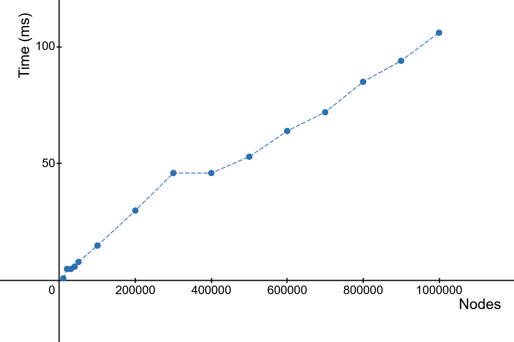
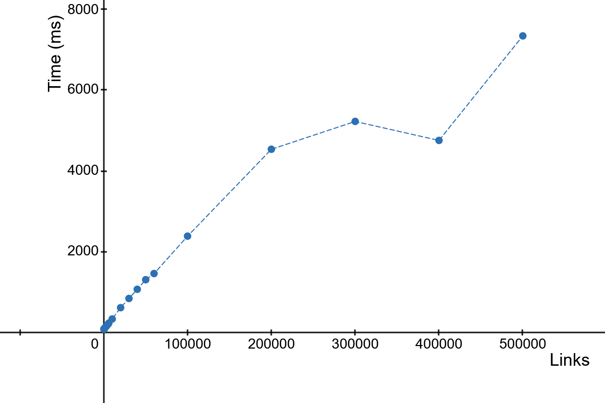
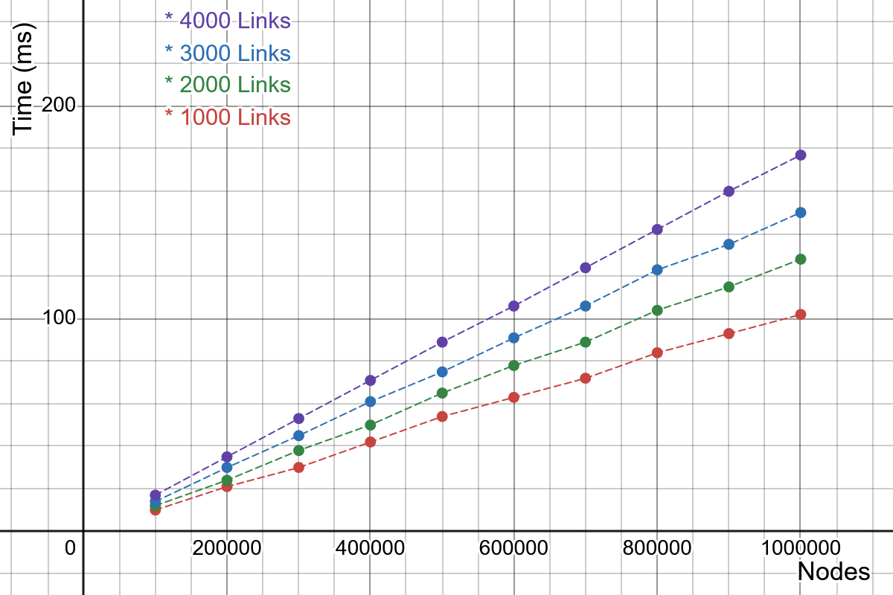

# TopoSort Algorithm - Set Based Topological Sort

William Wong
April 2, 2025

## Abstract

This presents TopoSort, a set-based topological sorting algorithm for directed acyclic graphs (DAG). 
Unlike traditional algorithms that produce a linear order of nodes, TopoSort yields a linear 
sequence of sets of nodes, where each set contains mutually independent nodes that can be 
used for parallel processing. The layered approach reveals structural parallelism in the graph 
and provides a built-in mechanism for detecting cycles. Further the nodes of the sets when 
arranaged in a linear sequence according to the order of the sets are also in topological order.

## 1. Problem Definition

Given a directed graph G=(V,E) where V is the set of nodes and E⊆V×V is the set of directed links,
we aim to compute a sequence of disjoint sets S=[S0, S1, …, Sk] such that:
  1.  ∐ Si=V′, where V′⊆V contains all nodes not involved in a cycle.
  2.  For all i<j, there is no link (u,v)∈E such that u∈Sj​ and v∈Si​.
  3.  Nodes within any Si​ are mutually independent (i.e., no links between them).

Nodes not included in any Si​ are identified as participating in a cycle.

## 2. Definitions

  1.  In-degree: Number of incoming links to a node.
  2.  Root node: A node with in-degree zero.
  3.  Root set: A set of root nodes at a given iteration.

## 3. Algorithm Overview

The main idea is to iteratively find the successive root sets of the graph after
removing each set at each round. 

The algorithm proceeds in iterations. At each round, it extracts the current 
root set (nodes with in-degree zero) and removes them from the graph. 
Their removal may expose new root nodes, forming the next root set. 
This process repeats until no new root nodes can be found.

A simplified outline:

 1. Find the first root set of the graph.
 2. Remove the nodes of the root set from the graph.
 3. Find the next root set.  Go to 2 until there's no more root node.

The successively removed root sets form a topological order. 
The nodes within each root set are mutually independent within the set.
The union of all root sets covers the acyclic portion of the graph. 
Remaining nodes are involved in cycles.

## 4. Example

Given a graph G(V,E) with the nodes of V=`{a, b, c, d, e, f}` and the links of 
E=`{ (a, d), (b, d), (d, c), (d, e), (e, f) }`, where `{a, b}` is the first root set,
successively removing the root sets look like:

```
{a, b} | {c, d, e, f}
{a, b} {d} | {c, e, f}
{a, b} {d} {c, e} | {f}
{a, b} {d} {c, e} {f} |
```
The final sequence of sets `[{a, b}, {d}, {c, e}, {f}]` forms a valid topological order 
because each set contains nodes that do not depend on any nodes in the sets that follow.

## 5. Rationale

In any directed acyclic graph (DAG), there necessarily exists at least one node 
with no incoming links — that is, a node that does not depend on any other node in the graph. 
Such nodes are referred to as root nodes. In the given example above, nodes `a` and `b` 
satisfy this condition and collectively constitute the initial root set of the graph, `{a, b}`.

Removing the nodes in a root set from the graph reduces the in-degree of each of their 
dependent nodes by one, effectively eliminating the corresponding incoming links. 
Any node whose in-degree reaches zero as a result becomes a new root node, as it 
no longer depends on any other node in the remaining graph. These newly uncovered 
root nodes collectively form the next root set. For instance, in the example above, 
node `{d}` becomes the root set after the first round.

It follows that each root set extracted during the iterative process is independent 
of all subsequent root sets. This is because the nodes within a given root set, 
by construction, have no dependencies on any nodes that remain in the graph — 
i.e., those nodes that will appear in later root sets.

The sequence of root sets extracted through successive iterations induces a higher-level 
graph structure, where each set can be viewed as a supernode. Directed links between 
these sets reflect inter-set dependencies derived from the original graph. 
In this induced graph, each set has no dependencies on any set that follows it 
in the sequence, thereby forming a valid topological ordering at the set level.

Q.E.D.

### 5a. Dependence Free Subsets

Within each root set, the constituent nodes are mutually independent, 
as root nodes by definition have no incoming links. This mutual independence 
enables concurrent or parallel processing of the nodes within a set, 
providing opportunities for efficient parallel computation.

Although nodes within a root set can be processed in parallel, 
the root sets themselves must be handled sequentially, as each set may 
depend on the completion of its predecessors in the topological sequence.

### 5b. Topological Sorting of Nodes

When the nodes from all root sets are concatenated in the order in which 
the sets were generated, the resulting sequence of nodes constitutes a 
valid topological ordering of the original graph. This follows directly 
from the fact that the root sets themselves are topologically ordered, 
and thus the nodes in any given set do not depend on nodes in subsequent sets. 
Further the nodes within each set are mutually independent.
Consequently, the linearized sequence of nodes respects all dependency 
constraints of the graph, satisfying the conditions of a topological sort.

## 6. Cyclic Node Detection

To facilitate cycle detection, the algorithm maintains a boolean array, 
referred to as the `rooted` list, which records whether each node has ever been
included in a root set.

During the construction of successive root sets, the algorithm inspects 
the immediate dependents of each root node. If a dependent node encountered 
has already been marked as rooted, this indicates the presence of a 
cycle — specifically, a back link from a node within the cycle to an earlier node already processed.

Rather than terminating the algorithm upon cycle detection, such cases are handled 
by simply skipping the traversal of already-rooted dependent nodes. This approach 
effectively bypasses the cyclic structure, allowing the algorithm to proceed with 
the acyclic portion of the graph. As a result, a partial topological sort may still be obtained.

Upon completion of the algorithm, any node that has not been marked as rooted 
must necessarily belong to a cycle, as it could not be reached without violating acyclicity.

## 7. Algorithm Detail

- Given a directed acyclic graph with N nodes, assign each node a unique identifier, 
  `id`, where id ∈ {0,1,…,N−1}.

- Define an array `dependents` of length N, where each element is a list of node id's
  representing the nodes that are directly dependent on the node indexed by the 
  corresponding element. In other words, `dependents[i]` contains the list of nodes 
  that have incoming links from node i.

- Define an array `incomings` of length N, where each element is the in-degree for
  the corresponding node indexed by the node id.  A value of zero indicates that 
  the node has been removed from the graph.

- Define an array `rooted` of length N, with each element initialized to false. 
  This array tracks whether a node has been included in any root set during the 
  algorithm's execution. A value of true signifies that the node has been processed
  as part of a root set.

- Define a variable `current_root_set` to store the list of node id's representing 
  the root set for the current round.  The root set consists of nodes that have no dependencies.

- Define a variable `next_root_set` to temporarily store the set of root nodes identified
  for the next round.

- Define a variable `result` as a list of sets, initially empty, which will hold the 
  final topologically sorted root sets.

- Initialize the first root set by scanning the `incomings` array to find nodes with 
  zero incoming links. Add these nodes to the `current_root_set`.

- Execute the iteration loop to identify and remove root sets from the graph, 
  updating result with each successive root set.
```
    while current_root_set is not empty         [1]
        append the current_root_set to result
        for each root_id in current_root_set    [2]
            rooted[root_id] = true
        for each root_id in current_root_set    [3]
            for each dep_node_id in dependents[root_id]    [4]
                if rooted[dep_node_id]
                    continue            // cycle detected; skip
                incomings[dep_node_id] -= 1
                if incomings[dep_node_id] == 0
                    append dep_node_id to next_root_set
        swap current_root_set and next_root_set
        clear next_root_set
```
- After the loop the result has a list of node sets in topological order.

- Scan the rooted array to find the set of cyclic nodes.
  Any node that has not been rooted is in a cycle.

## 8. Complexity Analysis

The time complexity of the algorithm is O(∣N∣+∣E∣) for acyclic graphs, 
where |N| denotes the number of nodes and |E| represents the number of links in the graph.

The number of iterations in the main loop (labeled as step [1] in the algorithm) 
is determined by the number of root sets identified in the graph. 
Each iteration processes the nodes in the current root set. 
The complexity of steps [2] and [3] is proportional to the number of nodes 
in each root set. Since the total number of nodes across all root sets 
equals the number of nodes in the graph, the overall complexity of steps [1], [2], and [3] is O(∣N∣).

The complexity of step [4], which processes the dependencies of each root node, 
is dependent on the number of links in the graph. Since each link is considered 
once during the process, the time complexity for step [4] is O(∣E∣).

Therefore, the overall time complexity of the algorithm is O(∣N∣+∣E∣).

In terms of space complexity, the algorithm requires O(∣N∣) space to store the arrays 
(incomings, rooted, current_root_set, next_root_set) for each node. Additionally, 
an array of lists, dependents, is used to store the dependency relationships, 
requiring O(∣E∣) space. Thus, the total space complexity is O(∣N∣+∣E∣).

## 9. Benchmark

[Benchmark Data](./README.md#benchmark-runs).

This shows the times spent as the number of nodes in the graph increases.
The number of links per node is fixed at 1000. 
The trend is linear and fits the asymptotic complexity predication of O(|N|).


This shows the times spent as the number of links per node in the graph increases.
The number of nodes is fixed at 1,000,000. 
The trend is linear and fits the asymptotic complexity predication of O(|E|).


This shows the times spent as the number of links per node and number of nodes in the graph increase.
The number of nodes is increased from 100,000 to 1,000,000, while the links per node increased
from 1000 to 4000. Note that the slopes getting more steep as the links per node increase because
each node has to spend more time processing its links.
The trends are linear and fit the asymptotic complexity predication of O(|N| + |E|).


